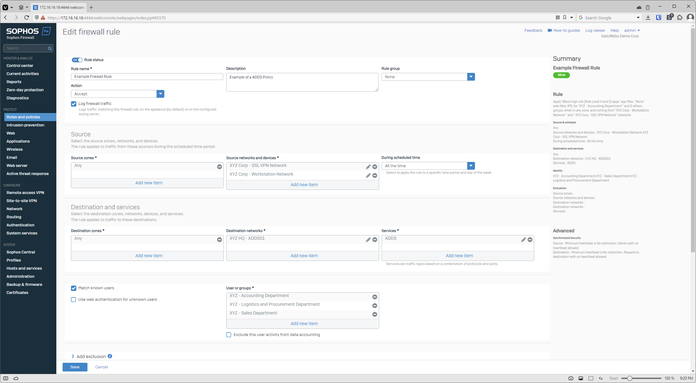
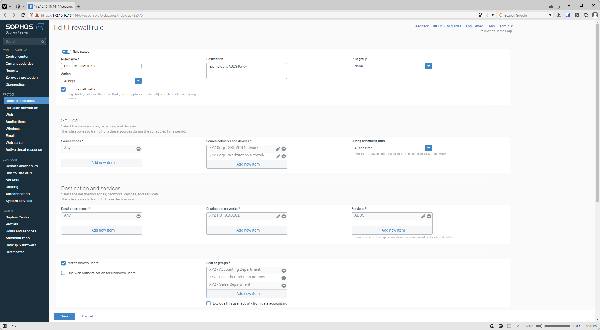

# Sophos SFOS Semi-Fluid Stylebot
## About
Ever felt like the Sophos SFOS could use a more fluid design? Well I have and I'm tired of waiting for Sophos to do. By modifying a couple classes and id's it's possible to make a semi-fluid design!

## Installation

Install a browser add-on such as StyleBot which allows you to modify CSS and save the contents of sophos-xgs.css as a style or modification.

## Hi-Res Display Support in SFOS v20
You might be asking if this modification is still relevant after the SFOS v20 update. Honestly I was hoping it wouldn't be but unfortunately Sophos still has a lot of work to do with respect to fluid support in SFOS

While this isn't the only example, it is the best. On the left is the semi-fluid modification and the right is Sophos Firewall OS v20.

|||
|--|--|
